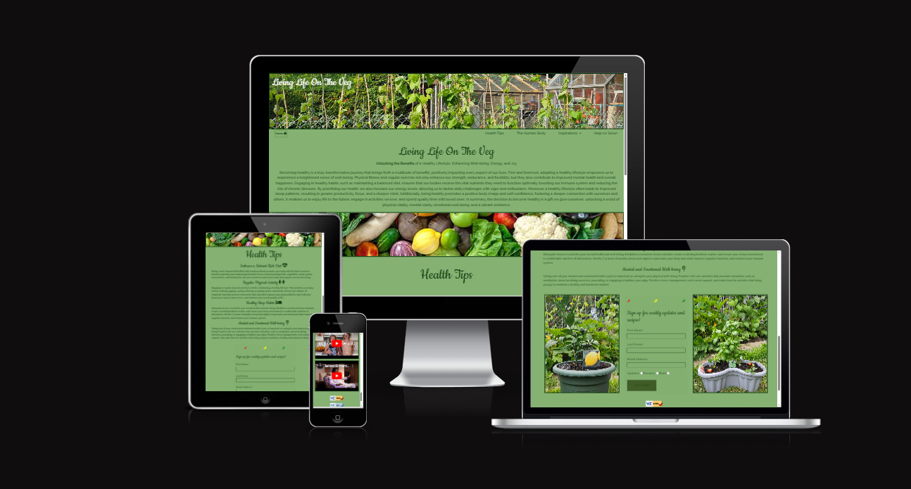

Created to provide guidance and inspiration for people interested in the human body; furthermore those specifically interested in becoming vegan as that is the most upcoming new lifestyle featured on this website. This website was made for educational purposes only.

This website is made up of the following sections:

[Visit My Website Here](https://rickylambert87.github.io/Project-1/)

1. Home/Introduction
2. Unlocking Benefits
3. 10 Fact about The Human Body
4. Form to sign up to Living Life On The Veg's newsletter

The business goals for this website are:

1. To advise users on how to eat well and live a good life on a budget
2. To inspire users to learn to grow foods and learn recipes to improve there lifestyle
3. Earn commission from links provided (cookbooks, healthy diet plans, products)
4. Build a database of users to send future information & content to, thus furthering the reach of the author.

The user goals of this website are:
1. As a first-time visitor, I want to easily find useful information & tips for healthy diets.
2. As a first-time visitor, I want to find inspiration for planning healthy meals.
3. As a first-time visitor, I want to find a helpful guide about the human body.
4. As a recurring or first-time visitor, I want to find recommendations from a trusted source for cookbooks/healthy diets/products.
5. As a recurring or first-time visitor, to easily find affiliate pages from the author, with even more inspiration available.
6. As a first-time user, I want to be able to sign up to directly receive content via a newsletter.

## UX
---
### **Strategy**

Considering the core UX principles I first started to think about the strategy for this website and defined who the target users would be and what features/technologies they would want.

Living Life On The Veg's target users are:
* Aged 18+
* Past/future health experts
* People interested in eating healthy on a budget
* Have an interest in changing there lifestyles

What these users would be looking for:
* Clear, concise, easy-to-find information
* Videos that provide inspiration and make the lifestyle choice look desirable
* Helpful guidance on routes available
* Recommendations for where and what to eat

This website will offer all of these things whilst also allowing for intuitive navigation and comfortability of use. An effort was taken to not provide an overwhelming amount of information at first glance as this is often the reason people are put off with healthy lifestyles.

Due to the age group of the users, it is assumed that most users will be viewing the site on their mobile phones and therefore creating something responsive is integral to the design.

### **Scope**
